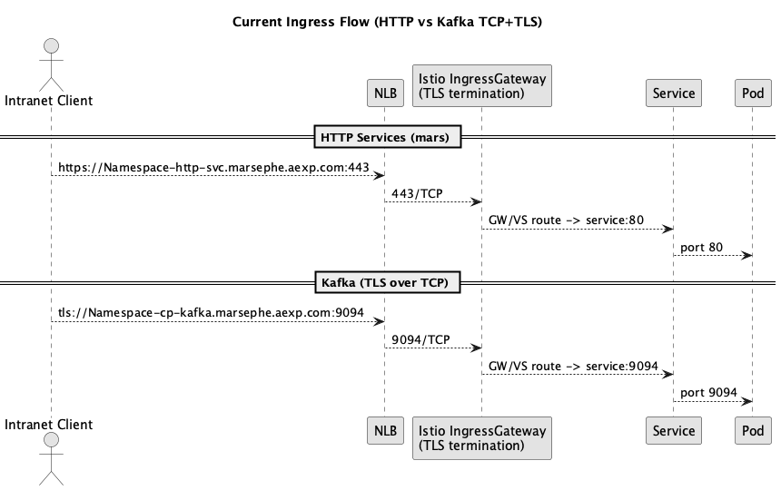
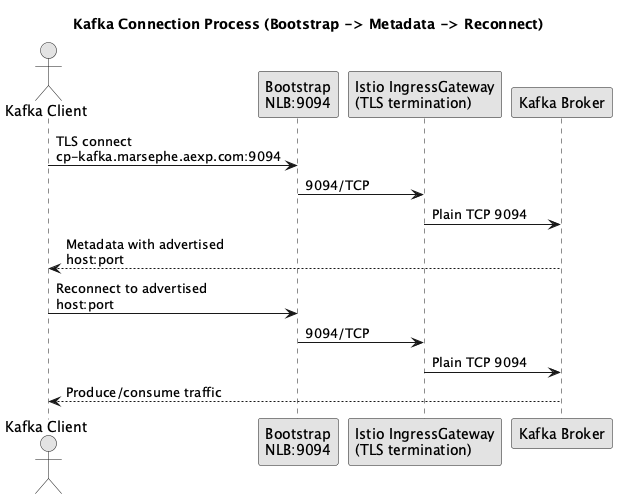

# Current Flow

## HTTP services
Developers connect to HTTP services via:

`https://namespace-mars-payment-service.marsephe.aexp.com`

Flow:
- Request hits port 443 on the NLB.
- NLB forwards to Istio.
- TLS terminates at `istio-ingressgateway`.
- Istio routes to the service on port 80, then to the pod.

## TLS over TCP (eg. Kafka)
We intend to follow the same flow for TCP traffic. Developers connect via:

`https://namespace-cp-kafka.marsephe.aexp.com`

Flow:
- Request hits port 9094 on the NLB.
- NLB forwards to Istio.
- TLS terminates at `istio-ingressgateway`.
- Istio routes to the service on port 9094, then to the pod.

Diagram:

# Why We Need Port 9094

- Kafka broker runs as a non-root container (AMEX policy).
- Non-root processes cannot bind to privileged ports <1024, so the broker cannot listen on 443 inside the pod.
- The external Kafka listener must bind to a non-privileged port (e.g., 9094).
- For external clients to connect, the NLB must expose that same port and forward it to the Kafka service/pod port 9094.
- If only 443 is open, clients can reach the load balancer, but Kafka cannot accept connections on 443 inside the pod, causing hangs or timeouts.

## Ask
Please open NLB listener `9094/TCP` and forward it to the Kafka service port `9094`. This keeps the broker non-root compliant while enabling external Kafka connectivity.

# Kafka Connection Process
Diagram:
- `01kafka-connection.png`

- Kafka requires the externally advertised host:port to be reachable because the bootstrap connection is only the entry point.
- After the initial handshake, the broker returns metadata containing its advertised address, and the client reconnects to that exact host:port.
- If the advertised port is not exposed on the NLB, the client cannot establish the follow-up connection, which results in timeouts or a hung request.
- Therefore, the external advertised endpoint, eg. `namespace-cp-kafka.marsephe.aexp.com:9094` must be directly reachable through the NLB.

